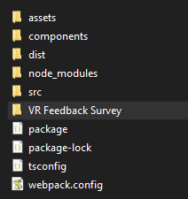

# CSD3120_Team16
| Team Members                  | Student IDs   |
| :---                          | :---          |
| Leonard Koh                   | 2000670       |
| Denise Goh                    | 2001220       |
| Jolyn Wong                    | 2001681       |
| Pho Kai Ting                  | 2002083       |
| Yu Ching Yin                  | 2002573       |
| Javin Ong J-Min               | 2000578       |
| Nurul Dania Binte Mohd Rizal  | 2002538       |

## Description
In this team group project, we decided to make a game. Our game is about catching the fruits while avoiding bombs in order to achieve the highest score possible.

## File Structure
<p>
  
</p>
Within the project hello-xr, the file structure as shown<br>
Assets - all the assets such as models and textures used for the application

## Video Demo Link

## User Evaluations 

[User Evaluations](https://github.com/Jj0606/CSD3120_Team16/tree/main/User%20Evaluations)

## How to navigate in the Game

- This game is suppose to run using webXR using oculus quest for the most immersive experience.
- The controller squeeze button is used to interact with the scene.
- Interactions include: Moving the plate to catch the fruits, resetting the scene as well as teleportation.

## Implementations

Some useful keyboard shortcuts:

| Keys      | Uses |
| :-------- | :--- |
| `Q`       | Toggle boundingBoxGizmo       |
| `W`       | Toggle positionGizmoEnabled   |
| `E`       | Toggle scaleGizmoEnabled      |
| `O`       | Toggle rotationGizmoEnabled   |
| `R`       | Reset Game                    |

Vr controller implementations:

- Use controllers `squeeze button` to select and move any objects in the scene.  
- Use controllers `squeeze button` to select `↻` button in the scene to reset game. 


## Instructions

Install npm
```
npm install
npm install copy-webpack-plugin --save-dev
```
Build and run server
```
npm run build
npm run serve
```
>*Then proceed to [Hello XR](http://localhost:3000/).*

## Dependencies

List of dependencies:

```
babylonjs
babylonjs-gui
babylonjs-loaders
babylonjs-materials
copy-webpack-plugin
html-webpack-plugin
ts-loader
typescript
webpack
webpack-cli
webpack-dev-server
```
